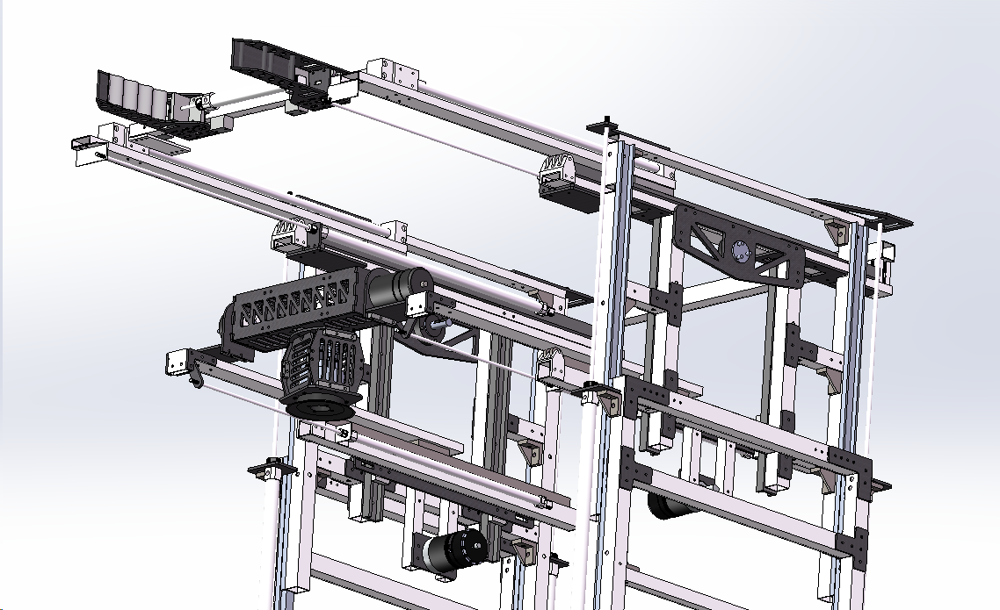

# RM2023 工程机器人

​	Robomaster2023赛季，着重强化了机器人的抓取与兑换功能。针对这一改动，有两个开发的大方向，一是维持框架伸缩变形结构，二是做机械臂结构。经过激烈的讨论之后，最终确定维持框架结构。 

由2022赛季的工程直接改造得到新工程，即：2022工程改造版本，改造得到的新机作为验证机确定了延用伸缩变形结构可行，但是直接改造得到是不适用于比赛的。 

​				

设计2023分区赛工程，由于新规则限制，我们舍弃了夹爪结构而全程采用吸盘获取与兑换矿石，同时增加了翻转矿石机构用于将矿石翻转到正确的姿态，即：2023分区赛版本

​		 

在分区赛之后，我们积极备战复活赛国赛，由分区赛表现得出结论：原有的设计是有很大问题的，基于已经发现的问题，我们从零开始设计新的结构与框架，将夹取与兑换结构分开设计，取消原有的矿石翻转机构等等，由此得到了新的复活赛国赛版本工程机器人，即：2023复活赛国赛版本。

## 1. 项目需求

### 1.1 需求

#### 1.1.1 底盘功能

1. 地形下不会出现翻车；
2. 机动性强；
3. 四驱独立悬挂；

#### 1.1.2 云台功能

两轴云台，保证操作视野稳定；

#### 1.1.3 矿石获取功能

1. 实现500mm最大前伸距离；
2. 实现空中截取矿石功能；
3. 实现对奇异姿态矿石的获取；

#### 1.1.4 矿石兑换功能

实现0—3级难度的矿石兑换；

#### 1.1.5 矿石翻转功能

1. 实现舱内矿石沿Pitch轴方向的旋转；
2. 实现舱内矿石沿Roll轴方向的旋转；

#### 1.1.6 拖拽救援功能

能够拖拽不同地面机器人回到己方补血点；

### 1.2 量化标准

#### 1.2.1 底盘功能

1. 悬挂减震下压距离在0 — 20mm之间；
2. 转向时侧倾角度在0°— 2.5°之间；

#### 1.2.2 云台功能

1. Pitch轴俯仰角限制在 -45°— 80°之间；
2. YAW轴航向角实现360°旋转；

#### 1.2.3 矿石获取功能

1. 实现0—500mm前伸距离；
2. 实现0—1000mm抬升距离；
3. 末端翻滚角实现360°旋转；
4. 俯仰角实现0°— 180°旋转；

#### 1.2.4 兑换功能量化

1. 实现0—300mm前伸距离；
2. 实现0—900mm抬升距离；
3. 双边实现各225mm横移距离；
4. 翻滚角实现360°旋转；
5. 俯仰角实现0°— 180°旋转；

#### 1.2.5 矿石翻转功能量化

1. 实现矿石沿底盘坐标系X轴方向的360°翻转；
2. 实现矿石沿底盘坐标系Z轴方向的360°翻转。

## 2. 机械部分

### 2.1 底盘

#### 2.1.1 麦克纳姆轮底盘

#### 2.1.2 轮组

### 2.2 伸展变形结构

#### 2.2.1 前伸机构

##### 2.2.1.1 分区赛版本

采用链条齿轮的连接方式，沿中轴线对称分布，对前伸滑轨做了全新选型，并在后端进行了配平。

##### 2.2.1.2 国赛版本

采用气缸 + 滑轨的结构

##### 2.2.1.2.1 上层前伸

1. 夹爪一级前伸

   

2. 夹爪二级前伸（磁偶气缸）

   

##### 2.2.1.2.2 下层前伸（吸盘机构前伸）

##### 2.2.1.3 涵道吸盘

#### 2.2.2 抬升机构

一级抬升：

二级抬升：

#### 2.3 翻矿机构

​	用于翻转储存仓内矿石的姿态。（分区赛版本）

​	翻矿机构可以快速调整夹取矿石的位置，将矿石平置，并同时夹取其他矿石，提高夹取矿石的效率
达成目标:

1. 翻矿机构主要由四个2006电机八个摩擦轮构成，可以全方向转动矿石
2. 电机数量多，工作效率高，翻矿速度快

#### 2.4 拖拽救援机构

​	采用了旋转气缸作为救援机构，在具体方案上，钩子材料为玻纤板，通过带有螺纹孔的小型加工件固定，这样的方式强度足够，轻量化，同时也便于装配。

## 3. 硬件部分

### 3.1 主控板

#### 3.1.1 主控一号板

#### 3.1.2 主控二号板

### 3.2 硬件连接拓扑图

## 4. 电控部分

### 4.1 重点功能

#### 4.1.1 底盘全向移动功能

​	底盘全向移动功能主要依赖于“全向移动算法”，在程序运行中传入vx、vy、vw，算法会解算并输出每个个舵向电机的旋转角度和每个动力电机的旋转速度，从而实现各轮组处于底盘不同运动状态下的精准控制。

#### 4.1.2 空中截取矿石功能

​	空中截取矿石功能在竞技中可以很大程度上增加己方抢夺矿石的能力，为之后建立经济优势提供了重要保障，运行时，当操作手按下“空接”，按键时，机器人执行“空接任务”，机器人变形伸展至设计的最大尺寸等待矿石掉落，当矿石落下至夹爪中间时，光电传感器反回检测数据，夹爪自动闭合，迅速夹住矿石，实现在空中截取矿石。

#### 4.1.3 取矿与兑换功能

​	取矿与兑换功能是工程机器人的基本功能，此功能可分为中央资源岛取矿、小资源岛取矿及兑换矿石三种工作场景，中央资源岛取矿和小资源岛取矿都可切换单次取矿和连续取矿两种工作模式。
兑换矿石时候可根据实际取矿情况选择实施兑换上方矿石还是兑换下方矿石，在取矿失败或操作误触时，操作手可以进行相应操作使机器人的工作状态返回上一步，也可以通过软件使机器人强制复位后再重新取矿或进行其他任务。

#### 4.1.4 机器人救援功能

​	在机器人救援功能下，操作手可以使用救援钩爪拖拽己方机器人至己方补血点，运行时通过操作I/O口输出电平信号控制对应气阀“伸出”或“收回”钩爪实现救援功能。

### 4.2 代码实现

​	具体代码已提交 github：

可点击下方链接跳转查看：

- [测试阶段工程代码（测试阶段）](https://github.com/zh-LuoXuan/RM2023-EngnieerRobot/tree/main/2022工程改造版本（测试阶段）)
- [2023 分区赛工程代码](https://github.com/zh-LuoXuan/RM2023-EngnieerRobot/tree/main/2023分区赛工程)
- [2023 国赛工程代码](https://github.com/zh-LuoXuan/RM2023-EngnieerRobot/tree/main/2023国赛工程)

### 4.3 测试记录

| 测试项目                                           | 测试环境 | 测试设备                           | 测试结果                                                     | 测试时间    |
| -------------------------------------------------- | :------- | ---------------------------------- | ------------------------------------------------------------ | ----------- |
| 测试2022赛季舵轮解算原代码是否在执行过程中被打断   | Keil MDK | PC机、ST-Link                      | 是                                                           | 2023.02.27. |
| 测试2022赛季舵轮解算原代码方向标志位是否多次被修改 | Keil MDK | PC机、ST-Link                      | 是                                                           | 2023.03.02. |
| 测试2022赛季舵轮解算原代码是否数据溢出             | Keil MDK | PC机、ST-Link                      | 否                                                           | 2023.03.07. |
| 测试气泵及吸盘抽负压能力                           | /        | 电源箱、拉力计                     | 抽负压速度未达到需求，拉力不够                               | 2023.03.08. |
| 测试夹爪机构瞬时抓取速度及力度                     | /        | 电源箱、电磁阀、脉冲发生器、拉力计 | 夹取速度快，夹取力度可达5N，符合要求                         | 2023.03.10. |
| 测试新舵轮全向算法                                 | Keil MDK | PC机、ST-Link                      | 无角度约束，目标角度正确，但是单个轮子存在转向方向不对的情况 | 2023.03.10. |
| 测试矿石翻转机构设计是否合理                       | Keil MDK | PC机、ST-Link                      | 否                                                           | 2023.03.12. |
| 测试新舵轮全向算法                                 | Keil MDK | PC机、ST-Link                      | 加入角度约束，存在转向进入死区无法控制情况                   | 2023.03.16. |
| 测试新舵轮全向算法                                 | Keil MDK | PC机、ST-Link                      | 死区问题得到解决，新舵轮全向解算可正常使用                   | 2023.03.18. |
| 测试夹爪电机上电找零功能                           | Keil MDK | PC机、ST-Link                      | 上电后，上电找零功能不可用                                   | 2023.03.19. |
| 测试夹爪电机上电找零功能                           | Keil MDK | PC机、ST-Link                      | 上电后，反复上电找零，结果异常                               | 2023.03.20. |
| 测试夹爪电机上电找零功能                           | Keil MDK | PC机、ST-Link                      | 上电找零正常                                                 | 2023.03.21. |
| 测试板间通信                                       | Keil MDK | PC机、ST-Link                      | 板间通信正常                                                 | 2023.03.25. |
| 测试底盘陀螺仪                                     | Keil MDK | PC机、ST-Link                      | 航向角存在温漂                                               | 2023.03.27. |
| 测试底盘陀螺仪                                     | Keil MDK | PC机、ST-Link                      | 航向角温漂更加严重                                           | 2023.03.28. |
| 测试底盘陀螺仪                                     | Keil MDK | PC机、ST-Link                      | 航向角数据先收敛后发散                                       | 2023.03.29. |
| 测试夹取矿石任务                                   | Keil MDK | PC机、ST-Link                      | 航向角稳定                                                   | 2023.03.30. |
| 测试空中截取取矿石功能                             | Keil MDK | PC机、JLink                        | 金矿、银矿夹取稳定                                           | 2023.04.01. |
| 测试空中截取取矿石功能                             | Keil MDK | PC机、JLink                        | 有掉落高度限制，不稳定                                       | 2023.04.01. |
| 测试0—2级兑换功能                                  | Keil MDK | PC机、JLink                        | 空中截取功能稳定                                             | 2023.04.02. |
| 测试0—3级兑换功能                                  | Keil MDK | PC机、JLink                        | 能实现，但效率太低                                           | 2023.04.02. |
| 测试0—3级兑换功能                                  | Keil MDK | PC机、JLink                        | 都能实现，但效率太低                                         | 2023.04.03. |

### 4.4 迭代记录

#### 4.4.1 主控制板迭代记录

| 版本号或阶段 | **版本备注**                                                 | **完成时间** |
| ------------ | :----------------------------------------------------------- | ------------ |
| **测试阶段** | 测试2022赛季舵轮解算原代码是否在执行过程中被打断；           | 2023.02.27   |
| **测试阶段** | 测试2022赛季舵轮解算原代码方向标志位是否多次被修改；         | 2023.03.02.  |
| **测试阶段** | 测试2022赛季舵轮解算原代码是否数据溢出；                     | 2023.03.07.  |
| **测试阶段** | 测试矿石翻转机构设计是否合理；                               | 2023.03.12.  |
| **v1.0**     | 优化2022赛季存在问题，重新推导舵轮运动学解算表达式，重写舵轮全向算法； | 2023.03.18.  |
| **v1.1**     | 板间通信建立，基本功能全部实现；                             | 2023.03.25.  |
| **v1.2**     | 底盘加入陀螺仪稳定姿态。                                     | 2023.03.30.  |

#### 4.4.2 副控制板迭代记录

| 版本号或阶段 | **版本备注**                     | **完成时间** |
| ------------ | :------------------------------- | ------------ |
| **测试阶段** | 测试气泵及吸盘抽负压能力；       | 2023.03.08.  |
| **V1.0**     | 暂时舍弃吸盘结构，使用夹爪结构； | 2023.03.10.  |
| **V1.1**     | 夹爪机构实现三自由度可动；       | 2023.03.15.  |
| **V1.2**     | 上电找零逻辑功能完成；           | 2023.03.21.  |
| **V1.3**     | 实现所有取矿及兑换任务；         | 2023.04.03.  |
| **V1.4**     | 拖拽救援功能实现                 | 2023.04.04.  |

### 4.5 重点问题解决记录

| 序号  | **问题描述**                                                 | **问题产生原因**                                             | 问题解决方案 & 实际解决效果                                  | **对应版本号或阶段** |
| ----- | ------------------------------------------------------------ | ------------------------------------------------------------ | ------------------------------------------------------------ | -------------------- |
| **1** | 舵轮全向移动效果不正常，具体体现在轮子会出现“反打舵”或“乱打舵”的情况。（2022赛季遗留问题） | 1、原代码段过于冗长导致任务执行时间片不够；2、原代码段内方向标志位被多次修改。 | **问题解决方案:**从原理上对算法进行重新推导并根据实际结构进行调整，重构该代码段;**实际解决效果:**轮子“反打舵”或“乱打舵”的情况得到解决。 | 测试阶段             |
| **2** | 夹爪电机上电找零功能不正常，具体体现在上电后各电机转动角度及转动顺序异常。 | 找零任务被其他任务抢占，找零状态标志被其他状态覆盖。         | **问题解决方案:**将创建找零任务放在其他任务中，保证在初始化过后工作状态为找零状态。**实际解决效果:**夹爪电机上电零功能正常。 | V1.0                 |
| **3** | 底盘加上陀螺仪后出现漂移                                     | 航向角与地面平行，由于磁场存在发生漂移。                     | **问题解决方案:**软件算法上进行滤波或积分处理。**实际解决效果:**底盘航向角漂移问题得到解决。 | V1.0                 |
| **4** | 夹爪找零时按下微动开关无效                                   | 1、微动开关接线连接不牢靠；2、微动开关损坏。                 | **问题解决方案:**重新接线并更换微动开关。**实际解决效果:**可以正常触发微动开关。 | V1.0                 |